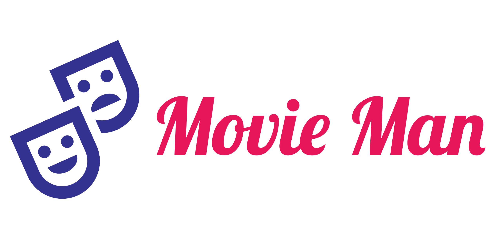

  

## Features
1. Get list of now playing movies!
2. Get list of trending movies!
3. Share movies with friends!
4. Browse collection offline!
5. Search movies on-the-fly!
6. Bookmark movies locally!
7. Explore any movie!
   

## Tech Stack / Libraries
1. [Retrofit](https://square.github.io/retrofit/): REST API client
2. [OkHttp](https://square.github.io/okhttp/): Network client
3. [Room](https://developer.android.com/training/data-storage/room): Persistent database built over SQLite
4. [View Model](https://developer.android.com/topic/libraries/architecture/viewmodel): Managing views with Live Data
5. [Paging 2](https://developer.android.com/topic/libraries/architecture/paging): Pagination of incoming data
6. [LiveData](https://developer.android.com/topic/libraries/architecture/livedata): Observable data holder for fetching data
7. [Dagger 2](https://developer.android.com/training/dependency-injection/dagger-android): Dependency injection
8. [Fresco](https://github.com/facebook/fresco): Image loader
9. [Firebase Crashlytics](https://firebase.google.com/docs/crashlytics): Real time crash monitoring
10. [View Binding](https://developer.android.com/topic/libraries/view-binding): Binding UI elements at compile time

## Setup
### Google Firebase Setup
1. Follow steps given [here](https://firebase.google.com/docs/android/setup) to obtain a file `google-services.json` and move that file to `app/google-services.json`.
2. Create SHA256 Key for your machine by running `./gradlew SigningReport` in the root folder of this project.
3. Perform Gradle sync in Android studio.

### TMDB API Keys Setup
1. Create "The MovieDataBase" API v3 keys by following the steps present [here](https://developers.themoviedb.org/3/getting-started/introduction).
2. Create a copy of `app/fakeapi.properties` and keep it as `app/api.properties`.
3. In `api.properties`, modify the `key` parameter's value and put the API key obtained above in Step 1.

## Screenshots
|  |  |  |
|  |  |  |
|  |  |  |

## Author
Chirag Jain